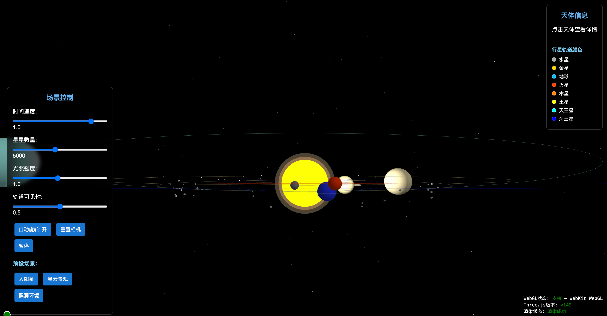

# Advanced Three.js Universe Demonstration

[](https://opensource.org/licenses/MIT)
[](https://threejs.org/)
[](https://www.khronos.org/webgl/)
[](https://github.com/yourusername/advanced-threejs-universe/graphs/commit-activity)

An interactive universe scene demonstration showcasing advanced Three.js framework capabilities. This project creates an interactive solar system model, including planets, asteroid belts, nebulae, and black holes, with various visual effects and user interactions.



## Features

### Core Functionality

- Complete solar system model including the sun, eight planets, and moon
- Asteroid belt simulation
- Planetary orbit visualization
- Nebula and star field background
- Responsive design for various screen sizes
- Flexible scene layout using Group containers for unified movement

### Visual Effects

- Advanced shader effects (custom sun material, nebula particle systems)
- Post-processing (Bloom glow effects)
- Realistic planet textures
- Normal maps for enhanced surface details
- Particle systems for nebulae and star fields

### Interactive Features

- Orbit controls allowing users to freely rotate and zoom the scene
- Click on celestial bodies to display detailed information
- Adjust star count and lighting intensity
- Switch between preset scenes (solar system, nebula landscape, black hole environment)
- Performance monitoring (FPS counter)

## Technical Implementation

- **Three.js**: Core 3D rendering library
- **Custom Shaders**: GLSL shaders for advanced visual effects
- **Post-processing**: Using EffectComposer and UnrealBloomPass
- **Particle Systems**: Using Points and BufferGeometry for nebulae and star fields
- **Mathematical Models**: Simulating planetary motion and Kepler's laws
- **Scene Organization**: Using Three.js Group objects for scene hierarchy and unified movement
- **Perlin Noise**: For generating natural nebula formations
- **Tween Animations**: Smooth camera transitions and UI animations

## Project Structure

```
/
├── index.html            # Main HTML file
├── css/
│   └── style.css         # Stylesheet
├── js/
│   ├── main.js           # Full implementation
│   ├── minimal.js        # Simplified version for performance optimization
│   ├── main-improved.js  # Enhanced implementation
│   ├── simplescene.js    # Basic scene implementation
│   ├── celestialBodies.js # Celestial body data
│   ├── effects.js        # Visual effects
│   └── interactions.js   # User interactions
└── textures/             # Texture image directory
```

## Local Setup

### Prerequisites

- Modern web browser (latest version of Chrome, Firefox, Safari, or Edge)
- Local web server (for serving the files)

### Installation

1. Clone this repository:
   ```bash
   git clone https://github.com/yourusername/advanced-threejs-universe.git
   cd advanced-threejs-universe
   ```

2. Start a local web server:

   **Using Visual Studio Code:**
   - Install the "Live Server" extension
   - Right-click on `index.html` and select "Open with Live Server"

   **Using Python:**
   ```bash
   # Python 3
   python -m http.server 8000
   
   # Python 2
   python -m SimpleHTTPServer 8000
   ```

   **Using Node.js:**
   ```bash
   # Install http-server globally if you don't have it
   npm install -g http-server
   
   # Start the server
   http-server -p 8000
   ```

3. Open your browser and navigate to:
   - VS Code Live Server: http://localhost:5500
   - Python/Node.js: http://localhost:8000

### Important Note

This project requires a web server to run properly because it loads JavaScript modules. Opening the HTML file directly in a browser will not work due to CORS restrictions.

## User Guide

- **Rotate View**: Click and drag
- **Zoom View**: Scroll mouse wheel
- **View Celestial Body Information**: Click on any planet or sun
- **Adjust Star Count**: Use the slider in the bottom right control panel
- **Adjust Light Intensity**: Use the slider in the bottom right control panel
- **Toggle Auto-rotation**: Click the "Auto-rotate" button
- **Reset View**: Click the "Reset Camera" button
- **Switch Scenes**: Click the preset scene buttons (Solar System, Nebula, Black Hole)

## Texture Resources

This project requires the following texture images (not included in the code):

- Planet textures: mercury.jpg, venus.jpg, earth.jpg, mars.jpg, jupiter.jpg, saturn.jpg, uranus.jpg, neptune.jpg
- Earth normal map: earth_normal.jpg
- Saturn rings texture: saturn_rings.png
- Moon texture: moon.jpg
- Asteroid texture: asteroid.jpg

You can obtain these textures from NASA or other free resource websites.

## Performance Considerations

- Post-processing and particle systems may affect performance on low-end devices
- If experiencing lag, reduce the star count or turn off auto-rotation
- On mobile devices, some advanced effects may automatically downgrade for better performance

## Recent Updates and Optimizations

The project has recently undergone several updates and optimizations:

- Improved scene organization structure, using Group containers for unified solar system movement
- Optimized planet rotation speeds, adjusting rotation rates based on planet size
- Improved asteroid belt rendering and animation
- Optimized camera angles for better viewing experience
- Streamlined rendering process for better performance
- Added responsive design support for mobile devices

## License

This project is licensed under the MIT License. Feel free to use and modify the code, but please retain the original author attribution.